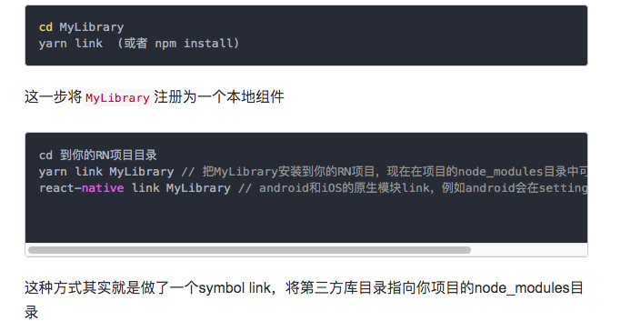
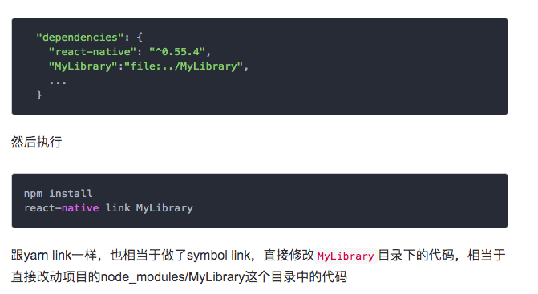
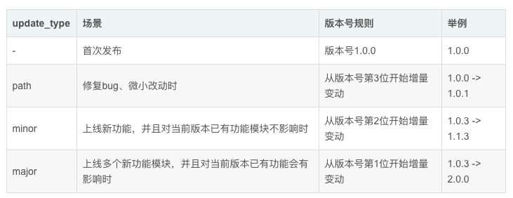
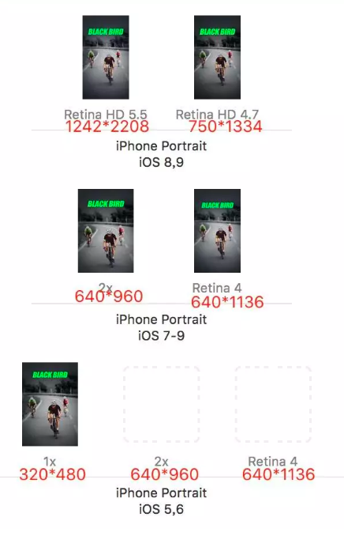
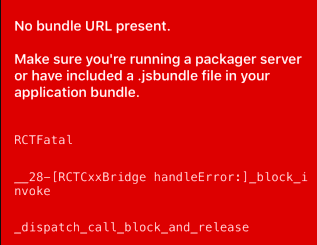
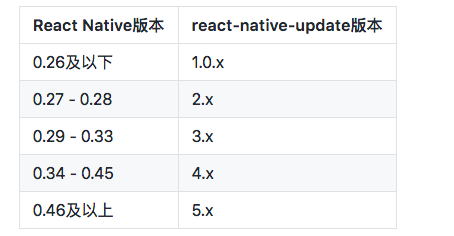
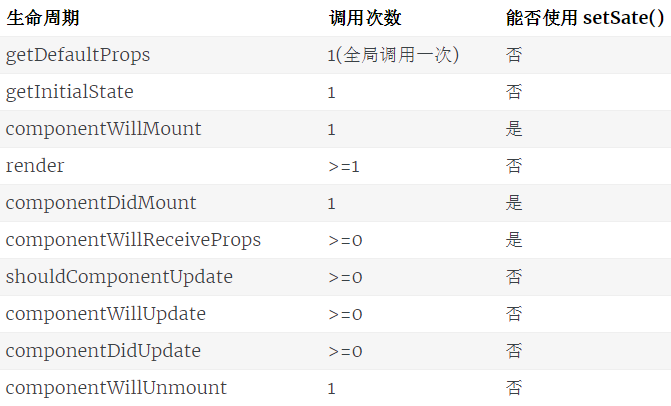
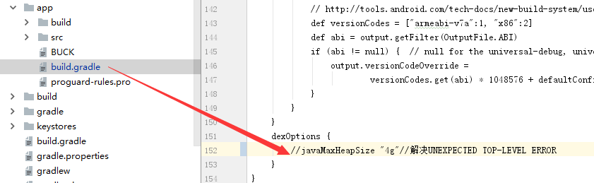
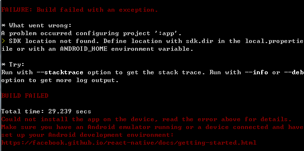
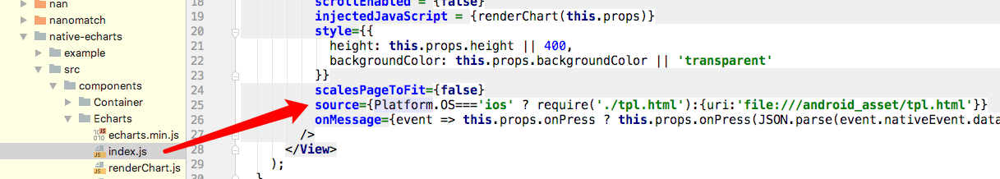

**

# **969、自定义插件**

 js与原生交互 

android: https://www.jianshu.com/p/edeb052740b2

ios: https://blog.csdn.net/zww1984774346/article/details/71167775

## ****969.1.安装react-native-create-library**

npm install -g react-native-create-library

## **969.2.创建插件项目**

react-native-create-library --package-identifier [包id] --platforms android,ios [名称]

## **969.3.引用**

### **969.3.1.直接复制到项目路径中** 

### **969.3.2.在package.json中配置酵路径**

### **969.3.3.直接copy本地代码** 

直接复制MyLibrary目录中内容到项目的node_modules/这个目录中，然后执行react-native link MyLibrary

### **969.3.4.上传到github**

发布地址：https://www.npmjs.com/settings/zouxiaolong/profile

3.4.1 .gitignore 和 .npmignore

在.gitignore中定义哪些文件不上传到github中

在.npmignore中定义哪些文件发布时不打包

如果有.gitignore但是没有.npmignore文件，那么.gitignore可以充当.npmignore的作用

具体规则可以参照：[npm-developers](https://docs.npmjs.com/misc/developers), [.gitignore or .npmignore pattern rules](https://git-scm.com/book/en/v2/Git-Basics-Recording-Changes-to-the-Repository#Ignoring-Files)

3.4.2 编写readme.md

3.4.3 发布：npm publissh(非首次发布：需先执行npm version <update_type>)  

# **970、./gradlew assmbleRelease命令不能**

chmod u+x gradlew

# **971、热更新**

https://blog.csdn.net/u011886447/article/details/78715407

https://blog.csdn.net/dounine/article/details/78529106

https://blog.csdn.net/oiken/article/details/50279871

code-push register 创建code-push账号

code-push login 登陆

code-push loout 注销

code-push access-key ls 列出登陆的token

code-push access-key rm <accessKye> 删除某个 access-key

code-push app add 在账号里面添加一个新的app  

code-push app add MyApp-Android android react-native

code-push app add MyApp-Ios ios react-native

code-push app remove 或者 rm 在账号里移除一个app 

code-push app rename 重命名一个存在app

code-push app list 或则 ls 列出账号下面的所有app

code-push app transfer 把app的所有权转移到另外一个账号

code-push release-react [app-name] [platform]发布更新

code-push release-react [app-name] [platform] --t [version] --dev false --d Production --des [desc] --m [是否强制更新]

code-push release-react MyApp-iOS ios

code-push release-react MyApp-Android android

code-push deployment add <appName> 部署

code-push deployment rename <appName> 重命名

code-push deployment rm <appName> 删除部署

code-push deployment ls <appName> 列出应用的部署情况

code-push deployment ls <appName> -k 查看部署的key

code-push deployment history <appName> Staging 可以看到Staging版本更新的时间、描述等等属性

## **971.1、安装code-push-cli**

npm install -g code-push-cli   

## **971.2、注册账号**

code-push register

## **971.3、登录**

*code-push login*

## **971.4、添加ios和android项目**

code-push app add [app-name] ios react-native

code-push app add [app-name]android react-native

查看

code-push deployment ls [app-name] -k

## **971.5、在项目根目录下添加react-native-code-push**

npm install react-native-code-push --save      注：**"react-native-code-push"**: **"^2.1.1-beta"**

## **971.6、link react-native-code-push**

react-native link

## **971.7、android配置**

# **8、ios配置**

a.将nod_module/react-native-code-push/ios/ CodePush.xcodeproj 拉入 上面的Libraries 目录下作为依赖项目

b.打开 Xcode的项目－》target －》Build Phase －》 Link Binary With Libraries,把刚才拖进去的子项目CodePush.xcodeproj 点开，找到Products 目录，把红色的libCodePush.a拉进去

c.点击 Link Binary With Libraries 下面的加号， 查找 libz ， 选中iOS 9.1 下面的 libz.tbd

d.选择上面的标题为 Build Setings 查找Header Search Path， 双击值，弹出列表界面，

点击加号， 输入  $(SRCROOT)/../node_modules/react-native-code-push,选择后面的 recursive 选项

e.打开  AppDelegate.m ,

添加  #import <CodePush.h>

 找到： 

 //  jsCodeLocation = [[NSBundle mainBundle] URLForResource:@"main" withExtension:@"jsbundle"];

 jsCodeLocation = [CodePush bundleURL];

**9、发布**

# **972、react5.5之后textinput不能输入中文**

修改源码

\1. [Libraries/Text/TextInput/RCTBaseTextInputShadowView.m](https://github.com/CHANOMA/react-native/pull/3/files#diff-8eb50d68d87e28556c034717cd58a86e)

@implementation RCTBaseTextInputShadowView

{

  ...

  NSString *_text;

  .....

}

\- (NSString *)text

{

  return _text;

}

\- (void)setText:(NSString *)text

{

  _text = text;

  _previousAttributedText = _localAttributedText;

}

2.[Libraries/Text/TextInput/RCTBaseTextInputView.m](https://github.com/CHANOMA/react-native/pull/3/files#diff-a5239f085f0beab82ba2c1643be157ac)

if (_onChange) {

​    //加入判断

​    if (_onChange && backedTextInputView.markedTextRange == nil) {

​      _onChange(@{

​         @"text": self.attributedText.string,

​         @"target": self.reactTag,

​         @"eventCount": @(_nativeEventCount),

​      });

​      }

}

# **973、react使用cocoapods**

## **973.1.什么是CocoaPods**

CocoaPods是OS X和iOS下的一个第三类库管理工具，通过CocoaPods工具我们可以为项目添加被称为“Pods”的依赖库（这些类库必须是CocoaPods本身所支持的），并且可以轻松管理其版本。

## **973.2.CocoaPods的好处**

1、在引入第三方库时它可以自动为我们完成各种各样的配置，包括配置编译阶段、连接器选项、甚至是ARC环境下的-fno-objc-arc配置等。

2、使用CocoaPods可以很方便地查找新的第三方库，这些类库是比较“标准的”，而不是网上随便找到的，这样可以让我们找到真正好用的类库。

## **973.3.使用步骤**

创建Podfile：pod init

# **974、react图标格式**

# **973、IOS上传到app store**

错误一、ERROR ITMS-90096: "Your binary is not optimized for iPhone 5 - New iPhone apps and app updates submitted must support the 4-inch display on iPhone 5 and must include a launch image referenced in the Info.plist under UILaunchImages with a UILaunchImageSize value set to {320, 568}. Launch images must be PNG files and located at the top-level of your bundle, or provided within each .lproj folder if you localize your launch images. Learn more about iPhone 5 support and app launch images by reviewing the 'iOS Human Interface Guidelines' at https://developer.apple.com/ios/human-interface-guidelines/graphics/launch-screen."

An unknown error occurred.

解决：把图片填全就行

错误二、ERROR ITMS-90717: "Invalid App Store Icon. The App Store Icon in the asset catalog in 'MMS.app' can't be transparent nor contain an alpha channel."

An unknown error occurred.

解决：图标不用透明和不包括alpha

错误三、ERROR ITMS-90685: "CFBundleIdentifier Collision. There is more than one bundle with the CFBundleIdentifier value 'com.ghlsqh.mms' under the iOS application 'MMS.app'."

An unknown error occurred.

解决方法：

- Open the (Your App).xcodeproj file (this is the first file on the project navigator pane).
- Switch to the target for your app extension (on the top left of the middle pane).
- Go to the Build Phases tab
- Click the X after “Embed Pod Frameworks”
- 

# **974、no bundle url present**

解决方法：关掉重启

# **975、reac标题不居中** 

# **976、日期控件** 

 [[UIDatePicker appearance] setLocale:[[NSLocale alloc]initWithLocaleIdentifier:@"zh_CN"]];//中文

 [[UIDatePicker appearance] setLocale:[[NSLocale alloc]initWithLocaleIdentifier:@"en_US"]];//英文

# **977、package.json**

1）指定版本：比如"classnames": "2.2.5"，表示安装2.2.5的版本

2）波浪号~+指定版本：比如 "babel-plugin-import": "~1.1.0",表示安装1.1.x的最新版本（不低于1.1.0），但是不安装1.2.x，也就是说安装时不改变大版本号和次要版本号

1）^+指定版本：比如 "antd": "^3.1.4",，表示安装3.1.4及以上的版本，但是不安装4.0.0，也就是说安装时不改变大版本号。

# **978、页面跳转回调**

this.props.navigation.navigate('TaskHandle',{

  taskId:taskId,

  callback:(data)=>{

  }

})

TaskHandle界面

this.props.navigation.state.params.callback(data);

this.props.navigation.goBack();

# **979、热更新**

npm i -g react-native-update-cli   //这一句在每一台电脑上仅需运行一次。 npm i react-native-update@具体版本请看下面的表格 react-native link react-native-update

# **982、MAC端搭建**

注：source /etc/profile

## **982.1、安装homebrew**

安装：/usr/bin/ruby -e "$(curl -fsSL https://raw.githubusercontent.com/Homebrew/install/master/install)"

卸载：/usr/bin/ruby -e "$(curl -fsSL https://raw.githubusercontent.com/Homebrew/install/master/uninstall)"

## **982.2、安装ruby**

brew install ruby 

## **982.3、安装****CocoaPods**

管理ios第三方库

安装：sudo gem install cocoapods 

然后执行：pod setup

pod setup命令执行后原理是将Spec项目复制到当前用户的.cocoapods\master目录下,以后的查找、安装使用都是基于该本地目录的.

安装成功后，就可以尝试使用了,以后更新新版本的Spec项目只需要再次执行pod setup即可

当有错误： error: RPC failed; curl 56 LibreSSL SSL_read: SSL_ERROR_SYSCALL, errno

解决方法：git clone https://git.coding.net/CocoaPods/Specs.git ~/.cocoapods/repos/master

注意：

需要导入第三方库 https://pan.baidu.com/s/1kVDUAZ9#list/path=%2F

# **984、打包**

## ****984.0、在android/app/src/main中创建assets,执行下面命令**

react-native bundle --platform android --dev false --entry-file index.js --bundle-output android/app/src/main/assets/index.android.bundle --assets-dest android/app/src/main/res/

react-native bundle --entry-file index.js --bundle-output ./ios/bundle/index.ios.jsbundle --platform ios --assets-dest ./ios/bundle --dev false

react-native bundle --platform android --dev false --entry-file index.js \--bundle-output android/app/src/main/assets/index.android.bundle

## **984.1、生成key，将生成的key文件复制到android/app下**

keytool -genkey -v -keystore my-release-key.keystore -alias my-key-alias -keyalg RSA -keysize 2048 -validity 10000

## **984.2、配置android/gradle.properties，加入如下(密码和alias是自己填)**

MYAPP_RELEASE_STORE_FILE=my-release-key.keystore

MYAPP_RELEASE_KEY_ALIAS=my-key-alias

MYAPP_RELEASE_STORE_PASSWORD=123456

MYAPP_RELEASE_KEY_PASSWORD=123456

## **984.3、配置android/app/build.gradle，加入**

android{

....

signingConfigs {

​    release {

​    storeFile file(MYAPP_RELEASE_STORE_FILE)

​    storePassword MYAPP_RELEASE_STORE_PASSWORD

​    keyAlias MYAPP_RELEASE_KEY_ALIAS

​    keyPassword MYAPP_RELEASE_KEY_PASSWORD

}}

buildTypes {

​    release {

​        signingConfig signingConfigs.release

​        .....

​    }

}

}

## **984.4、进入android运行**

win：gradlew assembleRelease

mac：./gradlew assembleRelease

# **985、深拷贝**

let originProto = Object.getPrototypeOf(value);

let params = Object.assign(Object.create(originProto), value);

# **986、react-navigation组件获取焦点和失去焦点**

this.props.navigation.addListener('willBlur', payload =>{});

this.props.navigation.addListener('willFocus', payload => {});

this.props.navigation.addListener('didFocus', payload => {});

this.props.navigation.addListener('didBlur', payload =>{});

# **987、触摸操作**

## **987.1、事件响应者**

//是否申请成为事件响应者成功

**onStartShouldSetResponder={(evt)=>{return true;}}**

//申请成功后，组件成为响应者，这时组件开始接收后续的事件输入，开始做事件处理或者手势识别的初始化

**onResponderGrant={(evt)=>{}}**

//申请被拒绝，意味着其它组件正在进行事件处理

**onResponderReject={(evt)=>{}}**

//表示手指按下时，成功申请为事件响应者的回调

**onResponderStart={(evt)=>{}}**

//表示触摸手指移动的事件，该回调非常频繁，所以内容尽量简单

**onResponderMove={(evt)=>{}}**

//表示触摸完成 的时候的回调，表示用户完成了本次的触摸交互，这里应该完成手势的识别，这以后，

//组件不再是事件响应者，组件取消激活

**onResponderRelease={(evt)=>{}}**

//表示组件结束后的回调

**onResponderEnd={(evt)=>{}}**

//在成为响应者期间，其它事件会申请成为触摸事件，会询问你是是否弃权

**onResponderTerminationRequest****={(evt)=>{return boolean}}**

//如果onResponderTerminationRequest返回true，就会调用，通知组件事件响应处理被终止

//这个回调也会发生在系统直接终止组件的事件处理，例如用户在触摸操作过程中，突然来电话的情况

**onResponderTerminate****={(evt)=>{}}**

## **987.2、事件数据结构**

- identifier：触摸的 ID，一般对应手指，在多点触控的时候，用来区分是哪个手指的触摸事件；注意：这里是RN的实际像素，如果要转换成逻辑像素 ，需要var pX = evt.nativeEvent.locationX / PixelRatio.get(); 
- locationX 和 locationY：触摸点相对组件的位置；
- pageX 和 pageY：触摸点相对于屏幕的位置；
- timestamp：当前触摸的事件的时间戳，可以用来进行滑动计算；
- target：接收当前触摸事件的组件 ID；
- changedTouches：evt 数组，从上次回调上报的触摸事件，到这次上报之间的所有事件数组。因为用户触摸过程中，会产生大量事件，有时候可能没有及时上报，系统用这种方式批量上报；
- touches：evt 数组，多点触摸的时候，包含当前所有触摸点的事件。

## **987.3、嵌套组件事件处理**

当组件需要作为事件处理响应者时，需要通过 onStartShouldSetResponder或者onMoveShouldSetResponder回调返回值为true来申请，假如有多个组件嵌套时，都返回true，但是同一个只能 有一个事件处理响应者，这种情况默认是采用冒泡机制，响应最深的组件先开始。在某些情况下，可能需要父组件处理事件，而禁止子组件响应。RN提供了一个劫持机制，也就是在触摸事件往下传递的时候 ，先询问父组件是否需要劫持，不给子组件传递事件，也就是如下两个回调：

**onStartShouldSetResponderCapture**：接收回调函数，函数原型是function(evt):bool，在触摸事件开始时，RN容器组件会回调此函数，询问组件是否要劫持响应者设置，自己接收事件处理，如果 返回true，表示需要劫持

**onMoveShouldSetResponderCapture**：同上，不过是在触摸移动事件时询问

## **987.4、手势识别库(PanResponder)**

PanResponder封闭了上面事件贺函数，对触摸数据进行加工，完成 滑动手势识别，向我们提供更加高级有意义的接口，如：

- onMoveShouldSetPanResponder: (e, gestureState) => bool
- onMoveShouldSetPanResponderCapture: (e, gestureState) => bool
- onStartShouldSetPanResponder: (e, gestureState) => bool
- onStartShouldSetPanResponderCapture: (e, gestureState) => bool
- onPanResponderReject: (e, gestureState) => {...}
- onPanResponderGrant: (e, gestureState) => {...}
- onPanResponderStart: (e, gestureState) => {...}
- onPanResponderEnd: (e, gestureState) => {...}
- onPanResponderRelease: (e, gestureState) => {...}
- onPanResponderMove: (e, gestureState) => {...}
- onPanResponderTerminate: (e, gestureState) => {...}
- onPanResponderTerminationRequest: (e, gestureState) => {...}
- onShouldBlockNativeResponder: (e, gestureState) => bool  //是否用Native平台的事件处理，默认是禁用的，全部使用JS中的事件处理，注意此函数目前只在 android平台上使用。这里回调函数 都有一个新的参数gestureState，这是与滑动相关的数据，是对基本触摸数据的分析 处理，内容如下：

- stateID：滑动手势的 ID，在一次完整的交互中此 ID 保持不变；
- moveX 和 moveY：自上次回调，手势移动距离；
- x0 和 y0：滑动手势识别开始的时候的在屏幕中的坐标；
- dx 和 dy：从手势开始时，到当前回调的移动距离；
- vx 和 vy：当前手势移动的速度；
- numberActiveTouches：当期触摸手指数量。
- 

# **991、创建指定版本的项目**

react-native init demo --verbose --version0.51.2

# **992、android使用echarts时出现图形较大**

native-echarts/src/components/Echarts/tpl.html

<meta name="viewport" content="width=device-width, initial-scale=1">

打包显示不出来 将tpl.html考到原生assets里面

source={Platform.OS==='ios' ? require('./tpl.html'):{uri:'file:///android_asset/tpl.html'}} 注：加入Platform

# **993、沉侵式的使用**

需要在StackNavigator中把navigation里面设置**header**:**false**,然后在需要的地方

<**StatusBar**

​    **animated****=**{**true**} *//指定状态栏的变化是否应以动画形式呈现。目前支持这几种样式：backgroundColor, barStyle和hidden*

​    **hidden****=**{**false**}  *//是否隐藏状态栏。*

​    **backgroundColor****=**{**'#00000000'**}

​    **translucent****=**{**true**}*//指定状态栏是否透明。设置为true时，应用会在状态栏之下绘制（即所谓“沉浸式”——被状态栏遮住一部分）。常和带有半透明背景色的状态栏搭配使用。*

​    **barStyle****=**{**'light-content'**} *// enum('default', 'light-content', 'dark-content')*

/>

# **994、Animated动画使用**

## **994.1、Animated.timing()创建旋转动画**，语法

Animated.timing(

someValue,{

toValue:number,

duration:number,

easing:easingFunction,

delay:number

})

## **994.2、Animated.spring()创建一个放大缩小的动画**

Animated.spring(

someValue,{

toValue:number,

friction:number

})

# **995、生命周期**

RN组件生命周期大致分为三个阶段

第一阶段：是组件第一次绘制阶段，在这里完成了组件的加载和初始化

第二阶段：是组件在运行和交互阶段，这个阶段可以处理用户交互，或者接收事件更新界面

第三阶段：是组件卸载消亡阶段，这里主要做一些组件的清理工件

**getDefaultProps(){}**

//严格的说，这不是组件的生命周期的一部分。在组件被创建并加载时，首先调用 getInitialState来初始化组件的状态

**componentWillMount(){}**

//在组件创建并初始化状态之后，在第一次绘制render之前，可以在这里做一些业务初始化操作，也可以设置组件状态。只调用一次

**componentDidMount(){}**

//在组件第一次绘制之后，被调用，通知组件已经加载完成，在这个函数调用的时候，其虚拟DOM已经构建完成，你可以在这个函数开始

//获取其中的元素或者子组件。注意RN框架是先调用子组件的componentDidMound,然后再调用父组件的函数。从这个函数开始，就可以

//和JS其它框架交互了，如计时器、网络请求。这个函数只被调用一次，这个函数后，就进入了稳定运行状态，等待事件触发

**componentWillReceiveProps(nextProps){}**

//如果组件收到新的属性(props)，就会被调用。输入参数nextProps是即将被设置的属性，旧的属性还是可以通过this.props来获取，

//在这个回调函数里面，你可以根据属性的变化，通过 调用 this.setState()来更新你的组件状态，这里调用 更新状态是安全的，并不

//不会触发额外的render调用

**shouldComponentUpdate(nextProps,nextState){}**

//当组件接收到新的属性和状态改变的话，都会触发调用,输入参数nextProps和上面的componentWillReceiveProps函数一样，nextState表示

//组件即将更新的状态值。这个函数的返回值决定是否需要更新组件，如为true表示需要更新，继续走后面更新流程，否则，不更新，直接进入等待

//状态。默认情况下，这个函数永远返回true用来保证数据变化的时候UI能够同步更新。在大型项目中，你可以重载这个函数，通过检查变化前后属性

//和状态，来决定UI是否需要更新，能有效提高应用性能

**componentWillUpdate(nextProps,nextState){}**

//如果组件状态或者属性改变，并且上面的shouldComponentUpdate返回为true,就会开始准备更新组件，并调用componentWillUpdate

//在这个 回调中，可以做一些在更新界面之前要做的事情。需要特别注意的是，在这个函数里面，你不能使用this.setStae来修改状态。在这个函数

//之后，就会把nextProps和nextState分别设置到this.props和this.state中，紧接着这个函数，就会调用render来更新界面

**componentDidUpdate(prevProps,prevState){}**

//调用了render更新完成界面之后，会调用componentDidUpdate来得到通知，因为在这里已经完成了属性和状态的更新，此函数输入参数就变了

**componentWillUnmount(){}**

//当组件要被从界面上移除的时候，就会调用，在这函数里面做清理工作，如取消计时器、网络请求等

**render()** 

这个方法是必须的，对视图进行渲染，你也可以返回 null 或者 false 来表明不需要渲染任何东西

# **996、处理文本输入**

TextInput是一个允许用户输入文件的基本组件。它有一个为onChangeText的属性，此属性接受一个函数，而此函数会在文本变化时被调用 。另外还一个名为onSybmitEditing的属性，会在文件被提交后(用户按下软键盘上的提交键)调用 

绑定文本：

方法1：

onChangeText={ this._onChangePswd }//在render里

_onChangeUserCode = (text) => {

​        this.setState({'userCode':text});

};

方法2：

onChangeText={ (text) => {

​        this.setState({'password':text});

}}

# **997、flexBox布局**

## **997.1、flex**

在组件样式中使用flex可以使其在可利用的空间中动态地扩张和收缩 ，一般而言用flex:1来撑满所有剩余的空间，如果有多个子组件使用了flex:1，则这些子组件会平分所有的空间。也可以按比例来分空间

## **997.2、Flex Direction**

在组件的style中指定flexDirection可以决定布局的主轴，水平轴(row)，竖直轴(column)

## **997.3、Justify Content**

在组件的style中指定justifyContent可以决定子元素沿着主轴的排列方式，其值有flex-start，center，flex-end，space-around以及space-between

## **997.3、Align Items**

在组件的style中指定alignItems可以决定其子元素沿着次轴的排列方式，基值有:flex-start、center、flex-end及stretch(注意：主元素上次元素不能有固定值，否则无效)

# **998、React Developer Tools调试**

进行断点调试时会出现跨域问题

解决方法一：node_modules/metro模块，修改Server/index.js、index.js.flow文件，在_processDeltaRequest方法在mres.setHeader("Access-Control-Allow-Origin", "*");

解决方法二：

右键谷歌-》属性-》快捷方式-》目标(最后面加上：--disable-web-security --user-data-dir)

# **999、安装Chocolatey**

Chocolatey是一个Windows上的包管理器，类似于linux上的yum和 apt-get

@"%SystemRoot%\System32\WindowsPowerShell\v1.0\powershell.exe" -NoProfile -InputFormat None -ExecutionPolicy Bypass -Command "iex ((New-Object System.Net.WebClient).DownloadString('https://chocolatey.org/install.ps1'))" && SET "PATH=%PATH%;%ALLUSERSPROFILE%\chocolatey\bin"

# **1000、**遇见的错误

## **1000.992、npm install出现unexpected end of file**

解决办法:npm cache clean --force 清空npm缓存即可

## **1000.993、node不能显示**

sudo brew uninstall node brew update brew upgrade brew cleanup brew install node sudo chown -R $(whoami) /usr/local brew link --overwrite node brew postinstall node

## **1000.994、Invalid maximun heap size:Xmx4g**

解决方法：

## 1000.995、npm install出现operation not permitted

解决方法：在管理员控制台运行npm install

## **1000.996.运行错误，找不到虚拟机**

解决方法：

在项目里面的android根路径里面创建一个文件local.properties

往里面加入：sdk.dir=D:\\software\\SDK   这是我的SDK位置

965****.xcode提示This app could not be installed at this time**

1.点击模拟器:

选择:

Hardware -> Erase All content and settings；清空模拟器的缓存

2.点击项目:

把项目清一下

shift+cmd+K

shift+opt+cmd+K

3.重新运行就OK

## **1000.997、从Xcode10到Xcode11出现的问题**

错误：ExceptionsManager.js:73 Unknown argument type '__attribute__' in method -[RCTLinkingManager getInitialURL:reject:].

解决：在RCTModuleMethod.mm的**static** **BOOL** RCTParseUnused(**const** **char** **input)方法添加

RCTReadString(input, "__attribute__((__unused__))") ||

## 1000.998、android使用echarts时出现图形较大**

native-echarts/src/components/Echarts/tpl.html

<meta name="viewport" content="width=device-width, initial-scale=1">

打包显示不出来 将tpl.html考到原生assets里面

source={Platform.OS==='ios' ? require('./tpl.html'):{uri:'file:///android_asset/tpl.html'}} 注：加入Platform

## **1000.999、打包错误，SDK版本不匹配问题**

1.首先在node_modules中找到报错的包里面的build.gradle，比如我这个就是\node_modules\react-native-version-number\android\build.gradle；

2.修改这个build.gradle，使其与android/build.gradle（也可能是android/app/build.gradle）里面的SDK版本保持一致；

3.将build.gradle里的compile改为implementation，因为compile已过时 .  注：有的需要改回来

## 1000.1000、npm install -g react-native-cli错误

出错信息：npm ERR! 404 401 Unauthorized: react-native-cli@latest

解决方法：

1.修改https 配置为http（前面已设置了npm config set registry https://registry.npm.taobao.org）

2.运行 npm config set registry http://registry.npmjs.org/

3.再运行npm install -g react-native-cli  成功